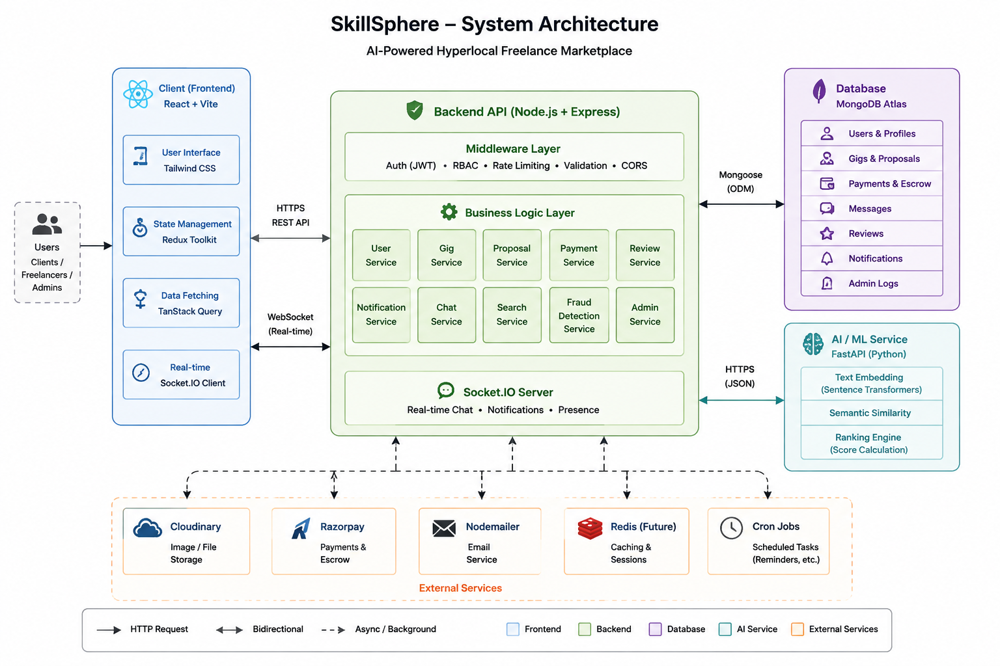
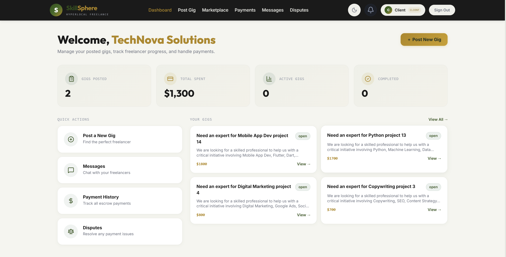
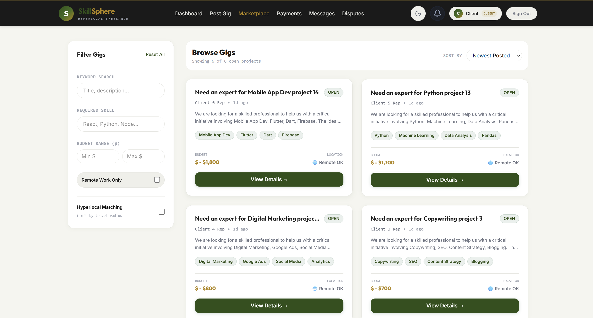
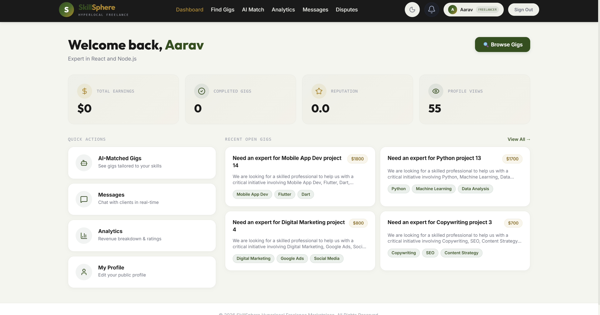
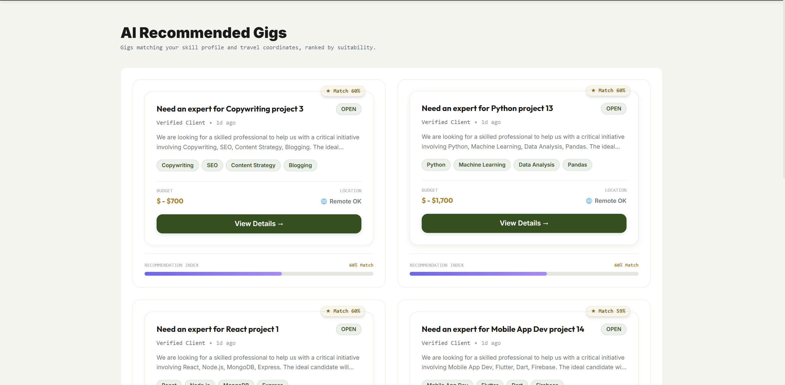

<div align="center">

# 🚀 SkillSphere

### Intelligent Hyperlocal Freelance Marketplace

Connect clients with skilled local freelancers using **AI-powered semantic matching**, **secure escrow payments**, and **real-time collaboration**.

<p>


</p>

</div>

---

## 📖 Overview

SkillSphere is a full-stack freelance marketplace built with the **MERN Stack** and **FastAPI**. Instead of keyword matching, it uses **Sentence Transformers** to recommend freelancers based on semantic similarity, reputation, and location.

The platform supports the complete freelance workflow including job posting, bidding, real-time chat, milestone-based escrow payments, reviews, and an admin dashboard.

---

## ✨ Features

- 🧠 AI-powered Freelancer Matching
- 📍 Hyperlocal Gig Discovery
- 💬 Real-time Chat
- 💳 Escrow Payment Workflow
- ⭐ Reputation & Review System
- 📊 Admin Dashboard
- 🔒 JWT Authentication & RBAC
- ☁ Cloudinary File Uploads

---

## 🏗 Architecture


---

## 🧠 AI Matching

Unlike traditional freelance websites, SkillSphere understands the **meaning** of job descriptions.

Ranking is based on:

- Semantic Similarity
- Reputation Score
- Geographic Proximity

**Model Used**

```
sentence-transformers/all-MiniLM-L6-v2
```

---

## 🛡 Fraud Prevention

The platform detects suspicious activity using rule-based heuristics.

- Review Spam
- Shared Device/IP
- Rating Outliers
- Payment Abuse

---

## 🛠 Tech Stack

| Frontend | Backend | AI | Database |
|----------|---------|----|----------|
| React + Vite | Node + Express | FastAPI | MongoDB Atlas |
| Tailwind CSS | Socket.IO | Sentence Transformers | Atlas Search |
| Redux Toolkit | JWT | NumPy | GeoSpatial Index |

---

## 📂 Project Structure

```text
skillsphere/

├── client/
├── server/
├── ml-service/
├── docs/
└── README.md
```

---

## 🚀 Getting Started

### Clone

```bash
git clone https://github.com/yourusername/skillsphere.git

cd skillsphere
```

### Install

```bash
# Backend
cd server
npm install

# Frontend
cd ../client
npm install

# AI Service
cd ../ml-service

python -m venv venv

pip install -r requirements.txt
```

### Run

```bash
# Backend
npm run dev

# Frontend
npm run dev

# AI Service
uvicorn app.main:app --reload
```

---

## ⚙ Environment

Create three environment files.

```
server/.env

client/.env

ml-service/.env
```

Copy values from the provided `.env.example` files.

---
## 📸 Screenshots

> Add screenshots of your application here.

| Dashboard(Client) | Marketplace|
|------|-----------|
|  |  |

| Freelancer | AI Matching |
|------|-------------|
|  |  |


---

## 🌐 API Overview

| Module | Endpoints |
|--------|-----------|
| 🔐 Authentication | Login, Register, Reset Password |
| 👤 Users | Profile, Portfolio |
| 💼 Gigs | CRUD Operations |
| 🤝 Proposals | Apply & Manage |
| 💬 Chat | Conversations & Messages |
| 💳 Payments | Create Order, Verify, Release |
| ⭐ Reviews | Ratings & Feedback |
| 👨‍💼 Admin | Users, Analytics, Fraud |
| 🤖 AI Service | `/embed`, `/match`, `/health` |

📖 **Detailed API documentation:** `docs/api-contract.md`

---

## 🚀 Deployment

| Service | Platform |
|----------|----------|
| Frontend | Vercel |
| Backend | Render |
| AI Service | Render |
| Database | MongoDB Atlas |

### Deployment Order

1. Deploy **ML Service**
2. Deploy **Backend**
3. Deploy **Frontend**

---

## 📈 Performance

- ⚡ Cached AI Embeddings
- 📍 GeoSpatial Indexes
- 🔍 MongoDB Atlas Search
- 💬 Socket.IO Real-time Events
- 🔄 TanStack Query Caching
- 🔐 JWT Authentication
- 🚦 Rate Limiting
- 🧩 Service Layer Architecture

---

## 🗺 Roadmap

### ✅ Completed

- AI Matching
- Hyperlocal Search
- Escrow Payments
- Real-time Chat
- Reviews & Ratings
- Admin Dashboard
- Fraud Detection

### 🚧 Planned

- Google OAuth
- Two-Factor Authentication
- Video Calls
- Mobile App
- Redis Caching
- Elasticsearch
- Docker Deployment

---

## 🤝 Contributing

Contributions are welcome!

```bash
# Fork the repository

git checkout -b feature/new-feature

git commit -m "Add new feature"

git push origin feature/new-feature
```

Open a Pull Request 🚀

---

## 👨‍💻 Author

**Krishna Lagad**

Third-Year IT Student • Full Stack Developer • AI Enthusiast

### Connect

- 💼 LinkedIn: https://linkedin.com/in/krishna-lagad-518158342
- 💻 GitHub: https://github.com/Krishna050305)
- 📧 Email: krishplagad0503@gmail.com

---

## 📜 License

This project is licensed under the **MIT License**.

---

<div align="center">

# ⭐ Star this repository if you found it useful!

Built with using **React • Node.js • FastAPI • MongoDB • Socket.IO**

### 🚀 SkillSphere — Connecting Talent with Opportunity

</div>
