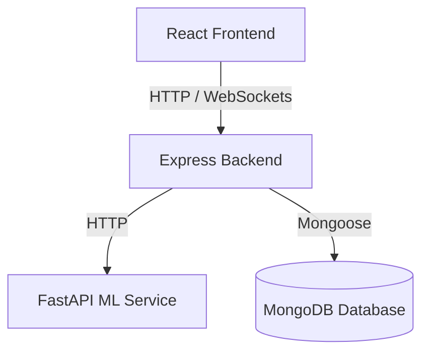

# SkillSphere System Architecture

SkillSphere is structured as a monorepo containing three core services that communicate with each other:

## Services Overview

1. **Client (React + Vite)**: 
   - Handles the visual interface using Tailwind CSS.
   - Global state managed via Redux Toolkit.
   - Server state, fetching, and caching managed by TanStack Query.
   - Real-time chat and updates supported by Socket.io-client.

2. **Server (Node.js + Express)**:
   - Configured with ES Modules.
   - Connects to MongoDB database using Mongoose.
   - Provides authentication, rate limiting, and core endpoints.
   - Employs WebSockets (Socket.io) for real-time channels.

3. **ML Service (FastAPI + Python)**:
   - Evaluates match scores between candidates and jobs.
   - Computes text embeddings using Hugging Face's `sentence-transformers` library (specifically `all-MiniLM-L6-v2`).
   - Supports a robust offline-fallback mock model for offline and dev environments.
